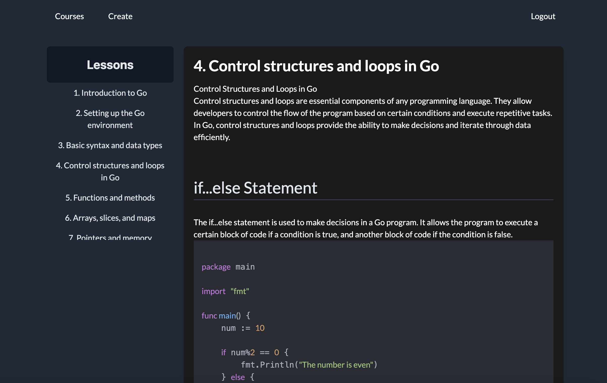
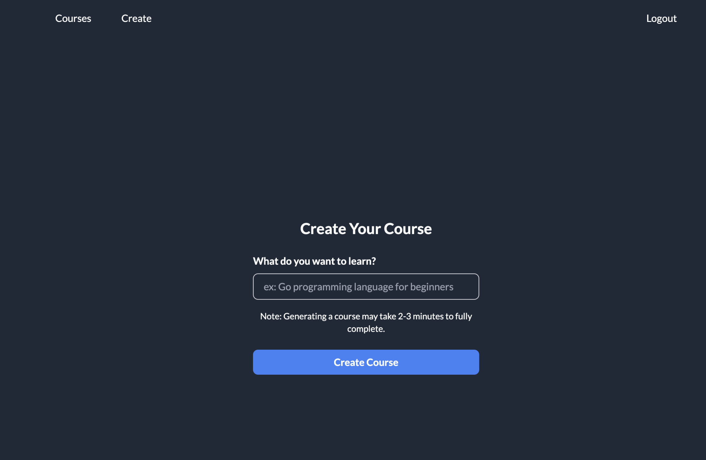

# 📖 PromptLearn | Create your own Lessons


**PromptLearn** is a web-application that leverages the OpenAI API to create dynamic, personalized content for an engaging and tailored learning experience. 

- 🚀 **User Input for Learning Goals**: Users can start by typing what they want to learn. Our system will then create a personalized course, broken down into several lessons, each tailored to the user's learning objectives.

- 💡 **Explore and Learn**: After the course generation, it's time for you to dive deep into the topics and absorb the knowledge. Each lesson is designed to be informative and engaging, ensuring a comprehensive learning experience.
  
- 📚 **Dynamic Course Content**: Utilizing the power of AI, PromptLearn dynamically generates course outlines and lesson content based on user input. This means every course is unique and specifically catered to individual learning needs.
  
- 🌐 **Interactive Learning Interface**: The application features an intuitive and user-friendly interface. With a clean layout and easy navigation, learners can focus on what's important - learning.
-----------------------------------------------------------------


-----------------------------------------------------------------

## Getting Started

To start using PromptLearn, follow these simple steps:

1. **Visit the Application**: Go to [PromptLearn's website](https://promptlearn-five.vercel.app/) .
2. **Create an Account**: Sign up for a new account or log in if you already have one.
3. **Set Your Learning Goals**: Tell us what you want to learn by typing in your learning objectives.
4. **Explore Your Personalized Course**: Browse through the course generated specifically for you and start learning at your own pace.

## Contributing

We welcome contributions to PromptLearn! If you have suggestions or want to improve the application, here's how you can set up the project for development:

### Prerequisites

Before you begin, ensure you have the following installed:
- [Node.js](https://nodejs.org/) (preferably the latest stable version)
- [Git](https://git-scm.com/) for version control
- A code editor of your choice (e.g., [VSCode](https://code.visualstudio.com/), [Sublime Text](https://www.sublimetext.com/))

### Setting Up the Project

1. **Fork and Clone the Repository**
   - Fork the PromptLearn repository to your GitHub account.
   - Clone your forked repository to your local machine:
     ```bash
     git clone https://github.com/your-username/PromptLearn.git
     ```
   - Navigate to the project directory:
     ```bash
     cd PromptLearn
     ```

2. **Install Dependencies**
   - Install the necessary Node.js dependencies:
     ```bash
     npm install
     ```

3. **Set Up Environment Variables**
   - Create a `.env.local` file in the root of the project.
   - Add the required environment variables:
     ```
     OPENAI_API_KEY=your_openai_api_key
     JWT_SECRET = your_jwt_key
     DATABASE_URL = your_mongodb_database_url
     ```

4. **Run the Development Server**
   - Start the development server:
     ```bash
     npm run dev
     ```
   - Open [http://localhost:3000](http://localhost:3000) in your browser to see the application.

### Making Changes

- Create a new branch for your feature or fix:
  ```bash
  git checkout -b your-branch-name
  ```
- Make your changes in the code.
- Test your changes to ensure everything works as expected.

### Submitting a Pull Request

- Push your changes to your fork:
  ```bash
  git push origin your-branch-name
  ```
- Go to the original PromptLearn repository on GitHub.
- Submit a pull request from your branch to the main PromptLearn repository.
- Provide a clear description of your changes and any relevant issue numbers.

We appreciate your contributions and will review them as soon as possible!

## License

This project is licensed under the [MIT License](LICENSE) - see the LICENSE file for details.

---
